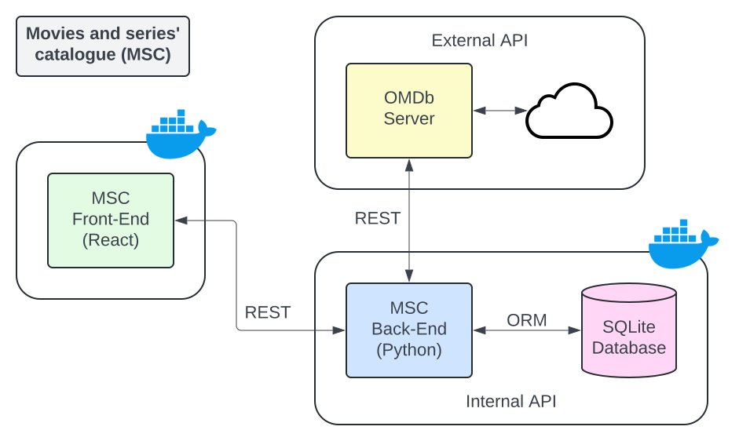

# Movie and series' catalogue (Front-end)

This project was done for the MVP from the sprint of **Advanced Back-end Development** as part of the Full Stack Development. This app is responsible for searching for movies and series and adding them on a catalogue. It is possible to rate them and it is also possible to check informations from their production. The OMDb API provides the content from the audiovisuals. The present documentation focuses on aspects of the front-end development.

This is a Single Page Application (SPA) composed by 2 main entities:
1. Home: search for movies or series and rate them;
2. Audiovisual: show information about the movie or series.

This app was developed using React and its scaffolding is made through `create vite@latest`.

___
## App visualization

In order to view this app in the browser, the following steps must be done:

1. Install a JavaSript's execution environment, such as `Node.js`: https://nodejs.org/pt/download/package-manager;

2. Execute the following command in the folder `.movies-and-series-catalogue` inside the project in order to install all its dependencies:

```
npm install
```

3. Execute the following command to run the application in development mode:

```
npm start
```

The Home page will be available at http://localhost:5173/

___
## Additional depenencies

Despite of the dependencies retrieved from `create vite@latest`, this app also relies on:
* react-router-dom (verion >= 6.24.0): to create routes in a SPA;
* @mui/material (version >= 5.12.20): to get components;
* @mui/icons-material (version >= 5.12.20): to use customizable icons.

___
## Project's overview


___
## External API

The audiovisual content comes indeed from the OMDb API. The interaction with OMDb happens actually in the back-end of the project. Whenever a POST request is done for an Audiovisual entity, the server performs a GET request to the OMDb API to retrieve the data. The client (back-end) sends here at most 3 parameters:
+ Required:
  + `apikey` -> `972b4e0f` (retrieved after a register)
  + `i` -> IMDb Id (first option)
  + `t` -> title from the movie or series (second option)
+ Optional:
  + `y` -> year from the movie or series (when title is used)

For further information about it, check https://www.omdbapi.com.

___
## Run with Docker

Before proceeding, it is important to have Docker installed: https://docs.docker.com/engine/install/.

### Build the image
Open the terminal in `.movies-and-series-catalogue`. The `Dockerfile` is there.
Execute the following command:

```
docker build . -t movies-and-series-catalogue-front-end
```

If everything succeds, an image named `movies-and-series-catalogue-front-end` will be created. To check it, run the following in the same terminal:

```
docker images
````

A similar response should be seen in a good scenario:

```
REPOSITORY                              TAG       IMAGE ID       CREATED          SIZE
movies-and-series-catalogue-front-end   latest    6c89d491d22a   25 minutes ago   676MB
```

#### Details of the image
This image provides a virtualized environment with all the dependencies from the `package.josn` and `node:18-alpine`.

### Run a container from the image
Now, execute the following to create a container from the image:

```
docker run --name msc-front-end -dp 3000:3000 movies-and-series-catalogue-front-end
```

It creates a container named msc-front-end, which binds the port 3000 of the container to the port 3000 of the host.

Whenever it is necessary to stop the container, do the following command:

```
docker stop msc-front-end
```

Now, there is no need to create again another container. To run the same one, just do:

```
docker start msc-front-end
```
